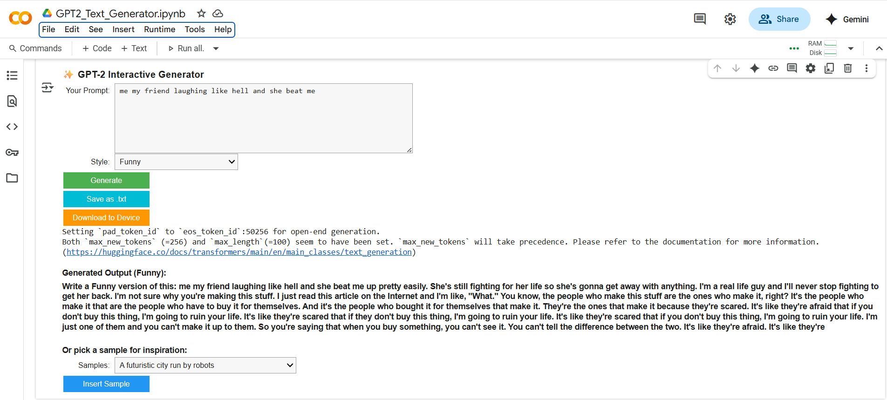

# GPT-2-Text-Generator
Interactive Text Generation project using GPT-2 and ipywidgets
## 📸 Preview



An interactive notebook that uses Hugging Face's `distilgpt2` model to generate human-like text from user prompts. Built with clarity, modularity, and usability in mind — perfect for showcasing Generative AI capabilities.

## 🔍 Project Overview

This project demonstrates text generation using a lightweight transformer model (`distilgpt2`) via Hugging Face. It features a clean UI with widgets for input, style control, and export functionality.

Created as part of the **Prodigy Infotech Generative AI internship**, it aligns with **Explainable AI** goals by offering structured outputs and user-driven customization.

## 🚀 How to Run

👉 [Open in Google Colab](PASTE-YOUR-COLAB-LINK-HERE)

## Steps:
1. Click `Runtime > Run all`
2. Enter a prompt in the input field
3. Choose a tone/style (e.g. formal, casual)
4. Click "Generate Text"
5. 📥 Press "Download Output" to save the result locally

## 📘 GPT-2 Text Generator with Widgets
An interactive GPT-2 demo using Hugging Face Transformers and `ipywidgets` for prompt customization, style control, and output management.

## 🚀 Run the Notebook
👉 [Click here to open in Google Colab](https://colab.research.google.com/github/VinjamuriPranaya/GPT-2-Text-Generator/blob/main/gpt2_text_gen.ipynb)

## ⚠️ Preview Warning

GitHub may not display this notebook correctly due to interactive widgets (`ipywidgets`).  
This is caused by missing widget metadata (`"state"` key) during Colab saves.  

🔧 To experience full interactivity, please **open the notebook using the link above**


## 📦 Requirements

Install dependencies via:

```bash
pip install -r requirements.txt

n Colab** using the link above.
